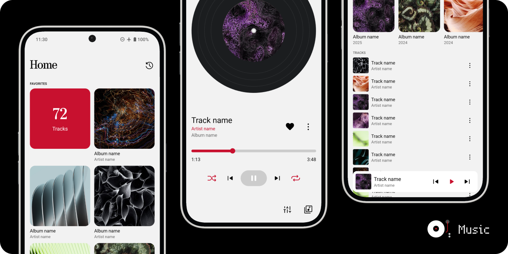

# Music

A Nothing inspired local music player (based on design by [Alkid Shuli (alKid)](https://bento.me/alkid)).

**The default branch (`dev`) is the development version of the repository. For the stable version, see the `main` branch.**

## Features

- Supports Android 7+
- Offline-First
- Supports Nothing Music Widget & Glyph Music Visualization
- Diverse music organization: Favorites, Playlists, Folder Structure, Albums, Artists
- Background playback w/ media control notification
- Queues
- Theoretical support of [these media formats](https://developer.android.com/media/platform/supported-formats#audio-formats)
- Control of where music is found

> See potential upcoming features in future updates in [this discussion post](https://github.com/MissingCore/Music/discussions/9).

# Design

Music is based on the design seen in this [comment on the Nothing Community forums](https://nothing.community/d/1825-nothing-music-player-app/2), created by [Alkid Shuli (alKid)](https://bento.me/alkid).

For information on the goals and ideology of this app, refer to the [`App Goals & Ideology`](./docs/app-goals-ideology.md) document.

> [!NOTE]  
> This app is designed to work best on "phone" layouts and isn't tested for larger screens (ie: tablets). We may improve the layout for larger screens in the future.

> [!IMPORTANT]  
> Be careful when clearing the cache of the app as if you accidentally clear the storage, all the data in the app will be deleted (ie: playlists, favorited tracks, artwork).

## Built With

[![Expo][Expo]][Expo-url]
[![React Native][React Native]][React Native-url]
[![TypeScript][TypeScript]][TypeScript-url]
[![Jotai][Jotai]][Jotai-url]
[![Zustand][Zustand]][Zustand-url]
[![React Query][React Query]][React Query-url]
[![React Native Track Player][React Native Track Player]][React Native Track Player-url]
[![Tailwind CSS][Tailwind CSS]][Tailwind CSS-url]
[![Drizzle][Drizzle]][Drizzle-url]

## Permissions

This (hopefully) lists out all the permissions required by Music based on the permissions asked in the code and values listed out in the [App Manifest](./mobile/android/app/src/main/AndroidManifest.xml).

|          | Permissions                                                                                                                                                                                                                                                                                    |
| -------- | ---------------------------------------------------------------------------------------------------------------------------------------------------------------------------------------------------------------------------------------------------------------------------------------------- |
| Popups   | - Music and Audio (Android 13+) - Files & Media (Android <13)                                                                                                                                                                                                                              |
| Implicit | - Read External Storage; for reading Music & Audio Files (unused in Android 13+) - Write to External Storage ([unused in Android 11+](https://developer.android.com/reference/android/Manifest.permission#WRITE_EXTERNAL_STORAGE)) - Internet (only used for checking for new updates) |

# Documentation

See all the [available documentation here](./docs). Some highlights include:

- [`Building this App`](./docs/building-this-app.md)
- [`Nothing Interactions`](./docs/nothing-interactions.md)
- [`Supported Gestures`](./docs/supported-gestures.md)

# Translations

Read the [Translations](./docs/translations.md) documentation for a rundown of how to contribute translations to this app.

| Translation |                      Translator                      |
| :---------: | :--------------------------------------------------: |
|   日本語    |   [@reindex-ot](https://www.github.com/reindex-ot)   |
|   Deutsch   |    [@The-Ladle](https://www.github.com/The-Ladle)    |
|  Indonesia  | [@naturbrilian](https://www.github.com/naturbrilian) |
|   Español   |        [@G4b-0](https://www.github.com/G4b-0)        |

# Legal

This application and code is published under the GNU Affero General Public License v3.0 (https://github.com/MissingCore/Music/blob/main/LICENSE).

Nothing Technology Limited or any of its affiliates, subsidiaries, or related entities (collectively, "Nothing Technology") is a valid licensee and can use this app for any purpose, including commercial purposes, without compensation to the developers of this app. Nothing Technology is not required to comply with the terms of the GNU Affero General Public License v3.0.

This app is developed by cyanChill and is not affiliated with, funded, authorized, endorsed by, or in any way associated with Nothing Technology or any of its affiliates and subsidiaries. Any trademark, service mark, trade name, or other intellectual property rights used in this project are owned by the respective owners.

## Licenses of Used Dependencies

Refer to [THIRD_PARTY.md](./THIRD_PARTY.md).

## License

[AGPL-3.0](./LICENSE)

## Privacy Policy

[Privacy Policy Link](./PRIVACY_POLICY.md)

<!-- MARKDOWN LINKS & IMAGES -->
<!-- https://www.markdownguide.org/basic-syntax/#reference-style-links -->

[Drizzle]: https://img.shields.io/static/v1?style=for-the-badge&message=Drizzle&color=222222&logo=Drizzle&logoColor=C5F74F&label=
[Drizzle-url]: https://orm.drizzle.team/
[Expo]: https://img.shields.io/badge/Expo-000020?style=for-the-badge&logo=Expo&logoColor=FFFFFF
[Expo-url]: https://docs.expo.dev/
[Jotai]: https://img.shields.io/badge/Jotai-000000?style=for-the-badge&logo=data:image/png;base64,iVBORw0KGgoAAAANSUhEUgAAACAAAAAgCAYAAABzenr0AAAAAXNSR0IArs4c6QAAAARnQU1BAACxjwv8YQUAAAAJcEhZcwAADsMAAA7DAcdvqGQAAAmFSURBVFhHxVd5cJRnGX/2+3a/PbKbzSabk4TcKQkNhJajBLCpA50BWyi1NLXVjg6HiuBMqaVIOQpCDzo1HKMSLTIw4FA6VcGxIFZKRUXOFoJFICSQk90keyV7fXv5e95sqJkC4l99kje72e99jvd5fs/veZe+bNEkX/8vafzVDlswFKoKhUKZlEjIer3ek2IyXlq0cEFXcss9yz0HsHPnTo3L433WmGJZmmq1TrBYUiWDXk+xRIJCgQD5fF7y+wf+FVPVbfYs+zvP1tfHkqp3lXsKYOu2bZZwOPJuYUnJzKqq0WTPsJPBaCBZlsXzWCxGwWCIXC4XXb16hTrabvxN0clzFy1c2Cs23EX+ZwC7du/WORw9R0ZXj6mrqRlHNlsawThJ0BxSTmDF8UeNxMjr9dKVK1foYtP5T1NSUqZ++/lv+Qd33V6k5OsdxXHTsaaoqKhu7JjqQedaWTgWTpOL37Po8MyamkrlZWVUVlZe4/P6GpKP7ih3DWBzQ0Ox0WRaPqqyklBznFqDkyYoDq9xVHjYQgp4abAHJ6fi4mJKS7PO37p129ikudvKXQMIBENL8vPzFZvNRhJyHo/FRb2jWPw69F78H42RGgohHQkRqNlspoKCAgkBv5A0d1vRvP3ThlpZq9spa+UI0Dz3pR+9eJUf7Nu3T9PV1d02uXZKfmlpKUBnhGEJJxRq4od/E3C4ueFtamxsFPUfP2E8bdr0FpyPpM7OTjp9+qQvG6idM/fJCGvu+PXO7HAkctBsTs0O+v1LpHgstrmivLzivor7Rit6/RrexOLx+Ipxinw+iQaOz5w+RTve+SXazQencZQiTgnUonH7z+HwTex3C71Pzp2jZ+rrCRxB4AcyGU2p7R2dNeIhJBgMLhuRmzextLioUKfTbpGMJiOwZaW83DzKyLDP2rdvv8Ib1ahaaTZbSKvVUsu1ZvrarFm04uWXacH87whDHARnYO/ePWJPRkYGZWbaSZZk5gM6+pcPRZsajSYaCATGsM4Hhz/QpNlss4uKS8hkMpFOlsworfQp19AC9JaUlqZD663fH/ijFAqE8mSZU64hh+MmFIxUWFRIbW3tyQCAfSYhnJRBVwmg1tTUkN1uJ51OB/wEhS7bAD7yWWdgIPTjopKyUdxNUTVCkWi0WUIa/9rb0wNjcSoqKqHSsvIfJiTNPy1W6ww2wE4mTpxE8xcspEJE/vrrb1AkEgXi4xQF8B555KsAqMypJS/KI+HUkqylyZMnC13GjSnFPGn/7w4czR9ZtLG0pASuEtTT6wR4o8c1u3btLggFg621tVPk3PwC0sCAy+2mT86cJZliVHV/NVmtVqRZR1o8Q+UHAZgUr8dDCxYtoOarV8XJOZsrV66kOY/PHiSly/+mPq+PHqqdQpn2TNGzXZ3tdOrkSXRKykRhqaFh84GKiorZ1WPGUpotHbXV0LmzZ8nV46BKUK81LU3UU2RkmPtBSeDn9Jkz5Opz0fjxD1J6ejqyE6V+ZISpWdYpNHXaV4Sex+0CSzZRc/PVM0uXLpkgeACAWN/a2hrv7uoi/0A/UhQDmLAdDrnWnG6nw4FnA/g/LgJhXhhasiTRpIkTacb06aRXFLDnTUFKrMtOdQApPqAA9Ls6O6ilpZkURVnHvm8d5s1Nm36Wk5WzuLq6muxZWXTps88EwMrLyykFrfhM/dN04sQ/RGtZwAkWBZOQyQm6EowHVZV8gSCF1TBNQDDv7X8fuAjAWYs4QM24cdTjdNCFCxfI6XQeWL78pSfY7+A4g8x5Ys5H3d3dMyORSC6fvgORmoBuG9LJtX3y609hFqRT240bVB+303hNClWRgUYl9FSrsVGdPpvaMvT03SU/oI0bXxNZ4jIwb/T29gA/El3GkLpxo+1aZlbW4384eDDIfoeVc82atVnRaORIbnbuWCAUALyfCgBMRW8Q6YxEI9R6/iKN2naKNCYDqTi/P65SmoTRjEnY8nQl5dQ9KALmANRwmLpQ1qamCyiNnrpvdrcaU0zTV65Y0ZJ0OXwWrF+/zgnNqe2d7b/RopasxJOOTxKGMXQLBXrdZM7MJMvIQrLlj6SM3HxKLSwiU24ORXs84l4Qwl7WYV2wK+kNBmrrbD9MmsSk/3bOcqsEQ3L8+HH1qXnzLptMKYuZHdnAUAC8vNc7qdSLE+dkk0bRMcJIAbFo8NqpHSC5KIvbQnQGJziGTPb3+8igU+pXrFhxbdDL53Lbaaiq6kymYRnojUYigmSCuHaFcLpIIkYJo5akDCvJmelkyM3CewSQaiJVws0IwA1gbzgUFs61ICUchjCAHk2aHya3DUCnU77BFwtmsRAMcfsJo+EQhS0KermXEsgGehBZUCiBIKM9LvKaZVEmngX+gF9kTANA80ADj9QnzQ+TL5TgF9sbp2C4vDIC4OP+Fsaw2DmfCKOb2jCc8toDJKH14m4fhdu76GzfFQo9VDIIPv4cNC1BXwsSYq5wu905Mx6dcfTwoUNtSVdCvpCBgD/wSnZ2DohCJ/qY2WyAM+D3C15Q9ArpHhtPH1fF6UTvJTrpuEjHMt3knldDRoNRpB42yIe6sy4HjowS24yo0VvjfkiGtSFuv3VarfIRTzYFSn19veB6tygDz3/+zGyx4HoGfKCvOXqGGrNeDOw50N8PwPVjWPHdQwMeMYkbNNN7OKLSZcwFf3//rGXLXjjE/lhuZWDPnr3acFjdMmLECKZJnLpfDBofG8V7Nj5UCg6GgWWFYcx3wZSgCdF+jJV+ZIyR73F7xFWd9RRwQ17eCMSl2fbu/v2mpNvPMTDugQdezLBnfjMnJ0cQiBN3AGawPhjgqcZl4JNxZ/AXEj3ISQujTFBMvz7s6e3DfpE17OeSIVhuYRZuZ17hkJre1d1l/fDPR0QWRAAbXnsjFy3225zsHF0CF08wFl2/fp2aW65heHT2OJzO8x6vV/W43TYY1OD+CGBhWMM4XzzcLjd1dLTTteZmau9oDzudPU19vX2dLrcrFcEr3A0MYOBTBOxwOibU1T185ONjxzoEBtasXq3v63Nv1xv0z0dUVcIVqhut954kS3vLSstPb9iwnktNS5csLe7p633OqDfUI+2jjUajBndKCuJrE9rv77C9q6S0+P3Vq1b18/6fbNigazp/YQpuz3Ox/zHsL0EpEmFV/RO+WT23dcsW1zAQrlv3arqi6M3Tpj3cPnVqrXB6J1m79lUrTp6dajXH8/LzOxZ/7/u4k99dNm/ZbB/w+GKr1q4ZvMF++UL0H/4Xon5r8LYmAAAAAElFTkSuQmCC
[Jotai-url]: https://jotai.org/
[React Native]: https://img.shields.io/badge/React_Native-222222?style=for-the-badge&logo=React&logoColor=61DAFB
[React Native-url]: https://reactnative.dev/
[React Native Track Player]: https://img.shields.io/badge/React_Native_Track_Player-7253ed?style=for-the-badge&logo=data:image/png;base64,iVBORw0KGgoAAAANSUhEUgAAABcAAAAVCAYAAACt4nWrAAAACXBIWXMAAAsTAAALEwEAmpwYAAAAAXNSR0IArs4c6QAAAARnQU1BAACxjwv8YQUAAAHzSURBVHgBjVXRccIwDDUc/2SDZgR3ArIBbECYADpB0gnCBqYTABMEJoBOQDpBsoErkWciHMPFdzrZlvQsPSuOUoFhrd2Q1BBDEnv2mKQQPrkaMsgxIbmRRADJALCBPYU9Ez68ToaAc1AWyJQBSug4EFP4WOMAPgdWcmM0GvH6QJKQ7LCW448kGgLe4ACZWUJqAfA0QMGHn9Ar8F8HDjoY1JAcAc56j7vRiNEh8EkgQ43sFqiCyz2RTElq6CtJyRoHNIg/9yhDhiW6wrXY3HUGfDJ5kTS/cAIMjks20PuHnzCuRWAG4f0ZKKixXroqBVghYjfY1wqTuVcJ9y8PI4BK0ZIXUa0NtCb7X8bg9CyNxFsDHitvn9cr1V74TLXt2QRas7rfHTg2nK04ObXdpx15FDiqIlFF4lW9e1CFA+58wrjH3IB7jfIzlwTpHPYU9HDcGjjPXyuyMbYbBQItMo9EZhpV5SLmhkNmDxo9rjiY+zsDnxp3kqiu552+QhrYc+L+KLEmqj/4Uz6R47c4cEeqpr0vmm9pPqX5StiZhtgHCoGzU+Xt8XPLJZewf3r2ClU+jdDb0nvd0Jon1ZZ/wNofzRDwq8wCF7gFMMvC9v9OGnHvh+hfY7t3pvC6pfB8bt5hbcUvDmDHJUr9CdEAH/dsBH3+AWtRo7d9AnSYAAAAAElFTkSuQmCC
[React Native Track Player-url]: https://rntp.dev/
[React Query]: https://img.shields.io/static/v1?style=for-the-badge&message=React+Query&color=FF4154&logo=React+Query&logoColor=FFFFFF&label=
[React Query-url]: https://tanstack.com/query/latest
[Tailwind CSS]: https://img.shields.io/badge/Tailwind_CSS-222222?style=for-the-badge&logo=Tailwind+CSS&logoColor=06B6D4
[Tailwind CSS-url]: https://tailwindcss.com/
[TypeScript]: https://img.shields.io/badge/TypeScript-3178C6?style=for-the-badge&logo=TypeScript&logoColor=FFFFFF
[TypeScript-url]: https://www.typescriptlang.org/
[Zustand]: https://img.shields.io/badge/Zustand-101417?style=for-the-badge&logo=data:image/png;base64,iVBORw0KGgoAAAANSUhEUgAAACAAAAAgCAYAAABzenr0AAAACXBIWXMAAAsTAAALEwEAmpwYAAAAAXNSR0IArs4c6QAAAARnQU1BAACxjwv8YQUAAAgQSURBVHgBzVdJbF1nFT7/Hd4d3jz6ObGSOE7ipFYSp3ESSgKlDK1gUSSoREAoqijqgkGsqdhEsEBs2QACiQ2IVRG0QaRq1FYQqY2SojghzWA76YvjeHjPb7rz9HPOfZ5rN2HB8MuS7/Df/5zzne985zyA//Fi8B9Y6XS6NHZ4/9lcPvdCp9NsvHt5/Gum6V2D/4YD2Wx294nR4TdsNxhybRvyhRxMz8x9WL41tedtgGDjfnHjg3K5nDoxdvDnp04c+ZkoshO2Y4y7btiEx1vqoQN7/hLYzsiLT+4Lv3V8NLxRm2bzlptv5jOvNhqtuY0fSBsfPP3U0V8pivT12dk6lPKFA67jP+c4D065rntndHR0l2u0P2849nBCkrZlUvr2rmG7buBP4/0tUZIE3Df2vU8fCYfKJfDDgD01OMCvzjZBF6T8Zh6vcyCdVvalM/rpmemHEFomN10XqpVSBV+9nstnW8Vi4Zgql5mmqMAEBs1mO/4u5ACWaUOz3YbID+DSvfuijicXU9lQRIw5cC7LrPZIB8r5whcXG4ssDRF/5cvPBH4QwU8vXJSgUtrX7ppgGSZEsoSGu6Ak5Pgb1/N72CdoWwGiiMP1jg//uHgdnh2qikYUEtFmLl+7c3czB4R13khywbJcOFDKRIzRvQjfOXk0TIQe5LPpmLER5/FeDyMl47SH4eYADStyzykZ/+uZLLxRa8Lr4/eg2Wn/DgiIRzlgW06Xo4GUlsDdDBzPY1MLsxIXVrf5QbgUsYwoSBDgvSQKQN/ZrrfucF1ToUJc8MIUbLHWVYHMQeurls9kEiIMZlNscu6BdG5yHsyIgbDGCYLfwejDMIrvDdOC7QPbYHBwBxTzGVAUGWbnG7FjDx7Og66rxySJ2YbpXPxYB9JpbZ+u6980HIf166Lwhxv3weQiHiSCLEkgIvEox8h4CMIQXIy4r1qEz546DlIYQOR5ICASGqagv1yABpIUUYRMJoMpzDzTqjf/6IXh/FYOKMPDu88zJuSYrMBUywZPIKO9yKMoAoEJMQfIeBAE8OSRERgoFaExXwcfOfFwoQ4hpkRTFdzLoFLMg4OVRKlJ6rogyuInf/jS6TNfGht5xY5c+8OZ+vsruKaT2nf7isWd6WQyjtZBDhC5ltd8fRHzvypkSV3mWTTUwdJrdQwoMgfOjsjwXHQXLNtZ2ffEnkF0yo8dPvPsJw4fTrCdx4u58tFq/w8Q7f5lB1i1Uv4+1bYgbK7OU/fu48F2fO1gRAP9ZdZpd3oveQQV8yGcvzUHb0V9MfnWrhF0oobasjepRl4QFLG83byqlpBXYeyApsnHi4XsLs/1Yas1evAAwRhfG4bBU9oqsXPZDNxOD8F7UIFkqRo/sx0H2l0jvi7kiJgJOHflAyEIA8H1/eit2xO/xXPmYyESIuFTqqJuaZxKTMUDlpemqSxaKsfee4QQgUPlAtOy4e79GRi/NQmqpvCvfOHpGFLi0o2Wzd5/7R2WSwg/ent84jf0PHZA0RN7SVA2LsdxYWx4Jy8kNbhyawLaLmcS8sP3VpE6/7f3sAxtKjWOZckociQsp3RmkvpKPokDZCNggnRpYuYcLAlTnAJFFsuwyaoWk3xIE2GPwvjzI7u5ZxkxGgFWBFUDkdJGJ9EYRxowD0uO0CAni9iGTx491DOOVePFiFFXiNdKtDECjDNno/EQP6qqOi9j9E7AeVJKwLZMki+iRKqqBrMLDdhWKcEx5MZE7QHbFTQhRGXMHj4GlUKWyYIIju3GZ92fmYNkUo81BJ3hyaTdXuJzzwHseq2NDpDytbsWy8pK1HZs5mM9T3cdlkqnIYGGJpHV/eUibK+WIY8kOzZ9FdyAw21Nh9ANIFyaPQilD6ZqkM1lsVg46UStXgdjHQK+618nIZHl1eZIGlCzAvbrS9cEhJzVTRfI+DKhBFTHy9duwtih/agbIvCQxdK7RjogxFT9/co4klbDb6iRIa8s+wKs8pbH23Mq7BzYtWcKe78Aj7GIPaSMbWzPJL1P7N4Bqt0l2CBZ3Rbz5CGm6OrNCZATCpavBkQSEqjJyannLTd8bSXQ5Yud2/veHBrc9Tli71aDIvV8xyM2C3EIFjIexyHoGgYkEJFMOoXvXaDZgVKYSqUgIQuxswHOFgv1+sSL03PDZ9H/5TNX2Oh7QSOdSX2DejlhQylYLk2+ppMT+4lMFGUvFayn/biXmK4qCiRQM0i0dE2JOyZ900G5btYXX/6rF9xYG9SqA2F4JwqD44V8di9fwoCw4GusR3z9TKGriTivaiIRR0wDCbVqEdGgE0RMPA0upmlCY3Hx9/WW8RPYsNapj2k57+BBp5O6mibDxFo6iQ4jROhwRgjgYyIe1TfnveGErgk6EhwNEcBRFRHxwUJlrC82/+kuNF/AWv9IuX8k3X35/EFUxjf7q30VMkLwhkuQU4tdRYSRrEDvL76KDXeQmHHkKEpdw4JWs32zbTY+g4/n2SZj2aZ8K6XTw6Ii/7lcyu/DQWKFMeQQjWQ0F6g49VCfj6ejuIn1EkeukIS3sFNi9K/a3uJLrRa0YIslbvbQ8rzGfsv+Zc31bGzBJ/GRRMQknSBhIfJZCDGyMU4BdrhYOSOcgBdbHTTevdHqGt+uN9o/xkJx4GPWI3+a7dhR2W123ZeRYF9FdR1CUWE0ojGalOKKQJ13Pe4iNKEfXujY5i8sy/sTbDEF/9sOrN1bKBQGHNM8KKvidpGxjO9GHNXOVRRlKp1j79Zq7cf9Cff/s/4F7+/6af92lLQAAAAASUVORK5CYII=
[Zustand-url]: https://zustand.docs.pmnd.rs/
