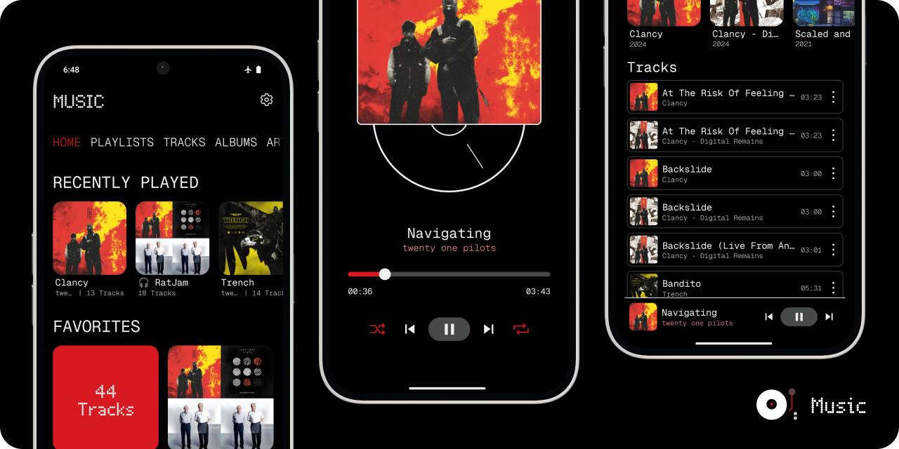

# Music

A Nothing inspired music player (based on design by [Alkid Shuli (alKid)](https://bento.me/alkid)).

<!-- TABLE OF CONTENTS -->
<details>
  <summary>Table of Contents</summary>
  <ol>
    <li><a href="#features">Features</a></li>
    <li><a href="#design">Design</a></li>
    <ol type="a">
      <li><a href="#built-with">Built With</a></li>
      <li><a href="#permissions">Permissions</a></li>
      <li><a href="#performance">Performance</a></li>
    </ol>
    <li><a href="#installation">Installation</a></li>
    <li><a href="#build">Build</a></li>
    <ol type="a">
      <li><a href="#unsigned-local-build">(Unsigned) Local Build</a></li>
      <li><a href="#signed-build-w-github-actions">Signed Build w/ GitHub Actions</a></li>
    </ol>
    <li><a href="#faq">FAQ</a></li>
    <li><a href="#legal">Legal</a></li>
    <ol type="a">
      <li><a href="#licenses-of-used-dependencies">Licenses of Used Dependencies</a></li>
      <li><a href="#license">License</a></li>
      <li><a href="#privacy-policy">Privacy Policy</a></li>
    </ol>
  </ol>
</details>

## Features

- Supports Android
- Play, Pause, Seek, Shuffle, Repeat
- Grouping Tracks by Albums (w/ Artwork) & Artists
- Playlists w/ Custom Artwork
- Favoriting Albums, Playlists, and Tracks
- Background Playback w/ Media Control Notification
- Queues
- Automatically extraction of metadata w/ [@missingcore/audio-metadata](https://github.com/MissingCore/audio-metadata)
- Data Backup

> See potential upcoming features in future updates in [this discussion post](https://github.com/MissingCore/Music/discussions/9).

# Design

Music is based on the design seen in this [comment on the Nothing Community forums](https://nothing.community/d/1825-nothing-music-player-app/2), created by [Alkid Shuli (alKid)](https://bento.me/alkid).

> [!IMPORTANT]  
> Be careful when clearing the cache of the app as if you accidentally clear the storage, all the data in the app will be deleted (ie: playlists, favorited tracks, artwork).

## Built With

[![Expo][Expo]][Expo-url]
[![React Native][React Native]][React Native-url]
[![TypeScript][TypeScript]][TypeScript-url]
[![Jotai][Jotai]][Jotai-url]
[![React Query][React Query]][React Query-url]
[![React Native Track Player][React Native Track Player]][React Native Track Player-url]
[![Tailwind CSS][Tailwind CSS]][Tailwind CSS-url]
[![Drizzle][Drizzle]][Drizzle-url]

## Permissions

This (hopefully) lists out all the permissions required by Music based on the permissions asked in the code and values listed out in the [App Manifest](./android/app/src/main/AndroidManifest.xml).

|          | Permissions                                                                                                                                                                                                                                                                                    |
| -------- | ---------------------------------------------------------------------------------------------------------------------------------------------------------------------------------------------------------------------------------------------------------------------------------------------- |
| Popups   | - Music and Audio (Android 13+)<br/>- Files & Media (Android <13)                                                                                                                                                                                                                              |
| Implicit | - Read External Storage; for reading Music & Audio Files (unused in Android 13+)<br/>- Write to External Storage ([unused in Android 11+](https://developer.android.com/reference/android/Manifest.permission#WRITE_EXTERNAL_STORAGE))<br/>- Internet (only used for checking for new updates) |

## Performance

> [!NOTE]  
> To understand what the benchmark means, we need to understand how Music save track metadata.
>
> When we open the app for the first time or after we add some new tracks to our device:
>
> 1. The app will detect any new tracks and automatically read the metadata via the [@missingcore/audio-metadata](https://github.com/MissingCore/audio-metadata) package. **This will cause you to be on the loading screen for a little bit.**
> 2. After the loading screen closes, the app will save the album/track artwork in the background in an optimal manner. **This will take some time and may cause some laggy behavior in the app**.
>
> Once this is completed, this logic won't run again unless Music detects that we added new tracks to the device.

Here are some benchmarks for saving 177 new tracks & 20 album/track artwork **during a development version** of this app. Do note that the production version of the app may be faster due to not having any debug logic running in the background.

| Device (OS Version)                    | Track Saving | Artwork Saving |
| -------------------------------------- | ------------ | -------------- |
| Nothing Phone 2a — Android 14 (v2.5.6) | ~15.1609s    | ~14.7705s      |
| OnePlus 6 — Android 11 (v11.1.2.2)     | ~30.9162s    | ~19.5772s      |

# Installation

There are 2 methods of installing this app:

1. Download the APK for your device from a release found in ["Releases" tab](https://github.com/MissingCore/Music/releases).

2. Download the app from the Google Play Store **[pending completion of closed test]**.

> [!IMPORTANT]  
> The APK & Play Store version of the apps **aren't compatible** as:
>
> - The APK is signed with an upload key.
> - The Play Store app is signed with a Google-generated app signing key via "Play App Signing".

# Build

These are instructions for building the app for personal use. Some general prerequisites are:

- Basic understanding of the command line
- [Node.js](https://nodejs.org/en/download/prebuilt-installer)
- Android Studio
  - You can follow [this quick start guide from Expo](https://docs.expo.dev/get-started/set-up-your-environment/?mode=development-build&buildEnv=local) (follow all the instructions until the "Running your app on an Android device" section)
- A code editor such as VSCode
- USB Debugging enabled device

## (Unsigned) Local Build

1. Clone the repository.

   ```sh
   git clone https://github.com/MissingCore/Music.git
   ```

2. Navigate to the project directory.

   ```sh
   cd Music
   ```

3. Install dependencies (we use `pnpm`, but your can use `npm`).

   ```sh
   npm i
   ```

4. Connect your Android device to your computer via a USB cable.

5. Run the following command to build the app locally on your computer via Expo, which will add the app to your phone upon completion.

   ```sh
   npm run android:prod
   ```

> [!NOTE]  
> You may receive a prompt on your device asking: "Allow USB debugging". Click **OK** to allow USB debugging on your PC. If you hit **Cancel**, the build command will fail. To allow USB debugging after canceling, reconnect your device with the USB cable and run the command again.

> [!NOTE]  
> This also generates the [different APK files](https://developer.android.com/ndk/guides/abis.html#sa) located in `android/app/build/outputs/apk/release`.

## Signed Build w/ GitHub Actions

This will create APKs that can be published to other stores via GitHub Actions when you create a new tag. Once the process finishes, a new release will automatically be created, with the APKs files attached. In addition, this will also create an `.aab` file that will automatically be upload to the Play Console.

1. Generate an upload key via `keytool` which comes with your installation of Java (this is referenced from [React Native's Guide](https://reactnative.dev/docs/signed-apk-android#generating-an-upload-key)). This will generate a `keystore.jks` file in the directory where `keytool` is located.

   ```sh
   sudo keytool -genkey -v -keystore keystore.jks -alias key-alias -keyalg RSA -keysize 2048 -validity 10000
   ```

> [!IMPORTANT]  
> **You should change `key-alias` to be something unique.**
>
> Keep the password you inputted as that'll be important later on.
>
> I found an issue with some characters in the password that kind of broke the behavior of the script when using GitHub actions (ie: `$`, `` ` ``, `=`), so you shouldn't use them.
>
> You can move `keystore.jks` to a different folder (ie: create a new folder in the `/Downloads` directory).

2. Open up `Git Bash` when it was installed with `git`. You want to go to the directory where the `keystore.jks` file is by running `cd "<directory>"`. Then run the following command to encode `keystore.jks` into a base64 file.

   ```sh
   openssl base64 < keystore.jks | tr -d '\n' | tee keystore.base64.txt
   ```

   > We want to encode `keystore.jks` in base64 as we want to keep this file secret and prevent exposing it. By encoding it in base64, we can save this as a GitHub Actions secret and use it within the workflow.

3. Clone this repository.

4. Now we need to add some secrets. When in the cloned repository, click: `Settings > Secrets and variables > Actions`. Click `New repository secret`. We're going to create 4 secrets:

   | Name                               | Secret                                                                                                                                                                                                                                                                                                                                                   |
   | ---------------------------------- | -------------------------------------------------------------------------------------------------------------------------------------------------------------------------------------------------------------------------------------------------------------------------------------------------------------------------------------------------------- |
   | `RELEASE_CRED`                     | _Remember to remove the angle brackets._<br/><pre><code>RELEASE_KEYSTORE_PASSWORD=<UPLOAD_PASSWORD from Step 1>&#13;RELEASE_KEY_ALIAS=<unique key-alias from Step 1>&#13;RELEASE_KEY_PASSWORD=<UPLOAD_PASSWORD from Step 1>&#13;</code></pre>                                                                                                            |
   | `KEYSTORE_BASE64`                  | Put the contents of `keystore.base64.txt`.                                                                                                                                                                                                                                                                                                               |
   | `MISSINGCORE_BOT_GITHUB_TOKEN`     | Put a [Fine-Grained Personal Access Token](https://docs.github.com/en/authentication/keeping-your-account-and-data-secure/managing-your-personal-access-tokens#creating-a-fine-grained-personal-access-token). This token should have `Read & Write` permissions for: `Contents`.                                                                        |
   | `GOOGLE_PLAY_SERVICE_ACCOUNT_JSON` | Paste the contents of the service account JSON file created by following the steps on the [r0adkll/upload-google-play GitHub Action Repository](https://github.com/r0adkll/upload-google-play?tab=readme-ov-file#configure-service-account). You don't need to give the service account permissions (ie: you don't need to give it `owner` permissions). |

That should be all the setup needed. Now whenever a new tag gets added to the repository that follows our version format, GitHub Actions will automatically call the workflow that builds the signed APKs.

# FAQ

> Why is the APK version of the app larger than the one from the Google Play Store?

You can [read this for the full explanation](https://github.com/expo/fyi/blob/main/android-app-size.md), but in short the APK is built to be used with any device. The version distributed by the Google Play Store is built for your device.

When looking at the `App size` field under `Space used` in the storage info for the app, you may notice the size displayed is **greater** than the download size. This is because what you downloaded is **compressed** and the app requires an **uncompressed** version of the libraries to be functional.

> Why is loading the app slow?

Refer to the [performance section](#performance) of this README.

> How do I add music to the app?

Place your music files in the "Music" folder on your Android device. It doesn't matter if you put the tracks directly into the folder or in sub-folders for better organization.

Look in [@missingcore/audio-metadata](https://github.com/MissingCore/audio-metadata) for supported audio files and metadata formats.

> What platforms are supported?

We officially support Android. Theoretically, this should also work for iOS (as this is React Native code), but this is untested as publishing on the App Store isn't feasible.

On Android, the app can be installed on all form-factors, however, we guarantee functionality and a better user-experience on "phone" layouts as that's our main audience. We may improve the layout for larger screens in the future.

# Legal

This application and code is published under the GNU Affero General Public License v3.0 (https://github.com/MissingCore/Music/blob/main/LICENSE).

Nothing Technology Limited or any of its affiliates, subsidiaries, or related entities (collectively, "Nothing Technology") is a valid licensee and can use this app for any purpose, including commercial purposes, without compensation to the developers of this app. Nothing Technology is not required to comply with the terms of the GNU Affero General Public License v3.0.

This app is developed by cyanChill and is not affiliated with, funded, authorized, endorsed by, or in any way associated with Nothing Technology or any of its affiliates and subsidiaries. Any trademark, service mark, trade name, or other intellectual property rights used in this project are owned by the respective owners.

## Licenses of Used Dependencies

Refer to [THIRD_PARTY.md](./THIRD_PARTY.md).

## License

[AGPL-3.0](./LICENSE)

## Privacy Policy

[Privacy Policy Link](./PRIVACY_POLICY.md)

<!-- MARKDOWN LINKS & IMAGES -->
<!-- https://www.markdownguide.org/basic-syntax/#reference-style-links -->

[Drizzle]: https://img.shields.io/static/v1?style=for-the-badge&message=Drizzle&color=222222&logo=Drizzle&logoColor=C5F74F&label=
[Drizzle-url]: https://orm.drizzle.team/
[Expo]: https://img.shields.io/badge/Expo-000020?style=for-the-badge&logo=Expo&logoColor=FFFFFF
[Expo-url]: https://docs.expo.dev/
[Jotai]: https://img.shields.io/badge/Jotai-000000?style=for-the-badge&logo=data:image/png;base64,iVBORw0KGgoAAAANSUhEUgAAACAAAAAgCAYAAABzenr0AAAAAXNSR0IArs4c6QAAAARnQU1BAACxjwv8YQUAAAAJcEhZcwAADsMAAA7DAcdvqGQAAAmFSURBVFhHxVd5cJRnGX/2+3a/PbKbzSabk4TcKQkNhJajBLCpA50BWyi1NLXVjg6HiuBMqaVIOQpCDzo1HKMSLTIw4FA6VcGxIFZKRUXOFoJFICSQk90keyV7fXv5e95sqJkC4l99kje72e99jvd5fs/veZe+bNEkX/8vafzVDlswFKoKhUKZlEjIer3ek2IyXlq0cEFXcss9yz0HsHPnTo3L433WmGJZmmq1TrBYUiWDXk+xRIJCgQD5fF7y+wf+FVPVbfYs+zvP1tfHkqp3lXsKYOu2bZZwOPJuYUnJzKqq0WTPsJPBaCBZlsXzWCxGwWCIXC4XXb16hTrabvxN0clzFy1c2Cs23EX+ZwC7du/WORw9R0ZXj6mrqRlHNlsawThJ0BxSTmDF8UeNxMjr9dKVK1foYtP5T1NSUqZ++/lv+Qd33V6k5OsdxXHTsaaoqKhu7JjqQedaWTgWTpOL37Po8MyamkrlZWVUVlZe4/P6GpKP7ih3DWBzQ0Ox0WRaPqqyklBznFqDkyYoDq9xVHjYQgp4abAHJ6fi4mJKS7PO37p129ikudvKXQMIBENL8vPzFZvNRhJyHo/FRb2jWPw69F78H42RGgohHQkRqNlspoKCAgkBv5A0d1vRvP3ThlpZq9spa+UI0Dz3pR+9eJUf7Nu3T9PV1d02uXZKfmlpKUBnhGEJJxRq4od/E3C4ueFtamxsFPUfP2E8bdr0FpyPpM7OTjp9+qQvG6idM/fJCGvu+PXO7HAkctBsTs0O+v1LpHgstrmivLzivor7Rit6/RrexOLx+Ipxinw+iQaOz5w+RTve+SXazQencZQiTgnUonH7z+HwTex3C71Pzp2jZ+rrCRxB4AcyGU2p7R2dNeIhJBgMLhuRmzextLioUKfTbpGMJiOwZaW83DzKyLDP2rdvv8Ib1ahaaTZbSKvVUsu1ZvrarFm04uWXacH87whDHARnYO/ePWJPRkYGZWbaSZZk5gM6+pcPRZsajSYaCATGsM4Hhz/QpNlss4uKS8hkMpFOlsworfQp19AC9JaUlqZD663fH/ijFAqE8mSZU64hh+MmFIxUWFRIbW3tyQCAfSYhnJRBVwmg1tTUkN1uJ51OB/wEhS7bAD7yWWdgIPTjopKyUdxNUTVCkWi0WUIa/9rb0wNjcSoqKqHSsvIfJiTNPy1W6ww2wE4mTpxE8xcspEJE/vrrb1AkEgXi4xQF8B555KsAqMypJS/KI+HUkqylyZMnC13GjSnFPGn/7w4czR9ZtLG0pASuEtTT6wR4o8c1u3btLggFg621tVPk3PwC0sCAy+2mT86cJZliVHV/NVmtVqRZR1o8Q+UHAZgUr8dDCxYtoOarV8XJOZsrV66kOY/PHiSly/+mPq+PHqqdQpn2TNGzXZ3tdOrkSXRKykRhqaFh84GKiorZ1WPGUpotHbXV0LmzZ8nV46BKUK81LU3UU2RkmPtBSeDn9Jkz5Opz0fjxD1J6ejqyE6V+ZISpWdYpNHXaV4Sex+0CSzZRc/PVM0uXLpkgeACAWN/a2hrv7uoi/0A/UhQDmLAdDrnWnG6nw4FnA/g/LgJhXhhasiTRpIkTacb06aRXFLDnTUFKrMtOdQApPqAA9Ls6O6ilpZkURVnHvm8d5s1Nm36Wk5WzuLq6muxZWXTps88EwMrLyykFrfhM/dN04sQ/RGtZwAkWBZOQyQm6EowHVZV8gSCF1TBNQDDv7X8fuAjAWYs4QM24cdTjdNCFCxfI6XQeWL78pSfY7+A4g8x5Ys5H3d3dMyORSC6fvgORmoBuG9LJtX3y609hFqRT240bVB+303hNClWRgUYl9FSrsVGdPpvaMvT03SU/oI0bXxNZ4jIwb/T29gA/El3GkLpxo+1aZlbW4384eDDIfoeVc82atVnRaORIbnbuWCAUALyfCgBMRW8Q6YxEI9R6/iKN2naKNCYDqTi/P65SmoTRjEnY8nQl5dQ9KALmANRwmLpQ1qamCyiNnrpvdrcaU0zTV65Y0ZJ0OXwWrF+/zgnNqe2d7b/RopasxJOOTxKGMXQLBXrdZM7MJMvIQrLlj6SM3HxKLSwiU24ORXs84l4Qwl7WYV2wK+kNBmrrbD9MmsSk/3bOcqsEQ3L8+HH1qXnzLptMKYuZHdnAUAC8vNc7qdSLE+dkk0bRMcJIAbFo8NqpHSC5KIvbQnQGJziGTPb3+8igU+pXrFhxbdDL53Lbaaiq6kymYRnojUYigmSCuHaFcLpIIkYJo5akDCvJmelkyM3CewSQaiJVws0IwA1gbzgUFs61ICUchjCAHk2aHya3DUCnU77BFwtmsRAMcfsJo+EQhS0KermXEsgGehBZUCiBIKM9LvKaZVEmngX+gF9kTANA80ADj9QnzQ+TL5TgF9sbp2C4vDIC4OP+Fsaw2DmfCKOb2jCc8toDJKH14m4fhdu76GzfFQo9VDIIPv4cNC1BXwsSYq5wu905Mx6dcfTwoUNtSVdCvpCBgD/wSnZ2DohCJ/qY2WyAM+D3C15Q9ArpHhtPH1fF6UTvJTrpuEjHMt3knldDRoNRpB42yIe6sy4HjowS24yo0VvjfkiGtSFuv3VarfIRTzYFSn19veB6tygDz3/+zGyx4HoGfKCvOXqGGrNeDOw50N8PwPVjWPHdQwMeMYkbNNN7OKLSZcwFf3//rGXLXjjE/lhuZWDPnr3acFjdMmLECKZJnLpfDBofG8V7Nj5UCg6GgWWFYcx3wZSgCdF+jJV+ZIyR73F7xFWd9RRwQ17eCMSl2fbu/v2mpNvPMTDugQdezLBnfjMnJ0cQiBN3AGawPhjgqcZl4JNxZ/AXEj3ISQujTFBMvz7s6e3DfpE17OeSIVhuYRZuZ17hkJre1d1l/fDPR0QWRAAbXnsjFy3225zsHF0CF08wFl2/fp2aW65heHT2OJzO8x6vV/W43TYY1OD+CGBhWMM4XzzcLjd1dLTTteZmau9oDzudPU19vX2dLrcrFcEr3A0MYOBTBOxwOibU1T185ONjxzoEBtasXq3v63Nv1xv0z0dUVcIVqhut954kS3vLSstPb9iwnktNS5csLe7p633OqDfUI+2jjUajBndKCuJrE9rv77C9q6S0+P3Vq1b18/6fbNigazp/YQpuz3Ox/zHsL0EpEmFV/RO+WT23dcsW1zAQrlv3arqi6M3Tpj3cPnVqrXB6J1m79lUrTp6dajXH8/LzOxZ/7/u4k99dNm/ZbB/w+GKr1q4ZvMF++UL0H/4Xon5r8LYmAAAAAElFTkSuQmCC
[Jotai-url]: https://jotai.org/
[React Native]: https://img.shields.io/badge/React_Native-222222?style=for-the-badge&logo=React&logoColor=61DAFB
[React Native-url]: https://reactnative.dev/
[React Native Track Player]: https://img.shields.io/badge/React_Native_Track_Player-7253ed?style=for-the-badge&logo=data:image/png;base64,iVBORw0KGgoAAAANSUhEUgAAABcAAAAVCAYAAACt4nWrAAAACXBIWXMAAAsTAAALEwEAmpwYAAAAAXNSR0IArs4c6QAAAARnQU1BAACxjwv8YQUAAAHzSURBVHgBjVXRccIwDDUc/2SDZgR3ArIBbECYADpB0gnCBqYTABMEJoBOQDpBsoErkWciHMPFdzrZlvQsPSuOUoFhrd2Q1BBDEnv2mKQQPrkaMsgxIbmRRADJALCBPYU9Ez68ToaAc1AWyJQBSug4EFP4WOMAPgdWcmM0GvH6QJKQ7LCW448kGgLe4ACZWUJqAfA0QMGHn9Ar8F8HDjoY1JAcAc56j7vRiNEh8EkgQ43sFqiCyz2RTElq6CtJyRoHNIg/9yhDhiW6wrXY3HUGfDJ5kTS/cAIMjks20PuHnzCuRWAG4f0ZKKixXroqBVghYjfY1wqTuVcJ9y8PI4BK0ZIXUa0NtCb7X8bg9CyNxFsDHitvn9cr1V74TLXt2QRas7rfHTg2nK04ObXdpx15FDiqIlFF4lW9e1CFA+58wrjH3IB7jfIzlwTpHPYU9HDcGjjPXyuyMbYbBQItMo9EZhpV5SLmhkNmDxo9rjiY+zsDnxp3kqiu552+QhrYc+L+KLEmqj/4Uz6R47c4cEeqpr0vmm9pPqX5StiZhtgHCoGzU+Xt8XPLJZewf3r2ClU+jdDb0nvd0Jon1ZZ/wNofzRDwq8wCF7gFMMvC9v9OGnHvh+hfY7t3pvC6pfB8bt5hbcUvDmDHJUr9CdEAH/dsBH3+AWtRo7d9AnSYAAAAAElFTkSuQmCC
[React Native Track Player-url]: https://rntp.dev/
[React Query]: https://img.shields.io/static/v1?style=for-the-badge&message=React+Query&color=FF4154&logo=React+Query&logoColor=FFFFFF&label=
[React Query-url]: https://tanstack.com/query/latest
[Tailwind CSS]: https://img.shields.io/badge/Tailwind_CSS-222222?style=for-the-badge&logo=Tailwind+CSS&logoColor=06B6D4
[Tailwind CSS-url]: https://tailwindcss.com/
[TypeScript]: https://img.shields.io/badge/TypeScript-3178C6?style=for-the-badge&logo=TypeScript&logoColor=FFFFFF
[TypeScript-url]: https://www.typescriptlang.org/
