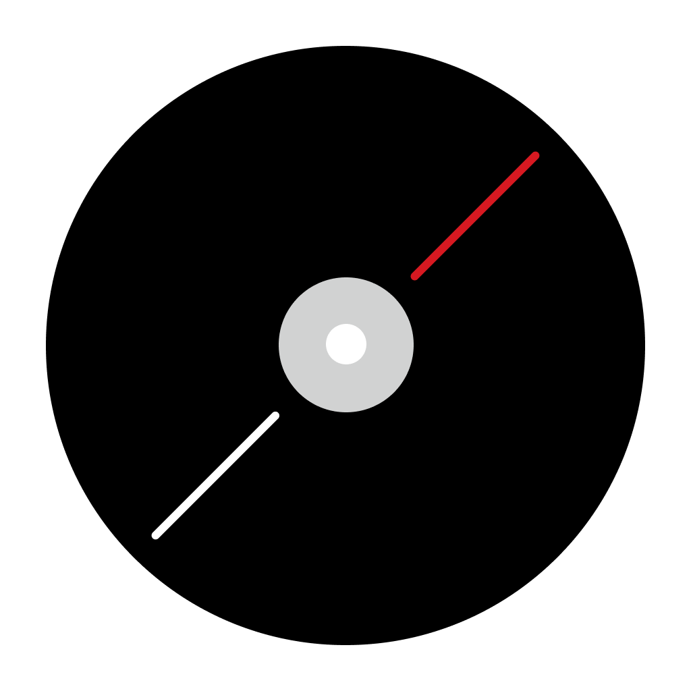

# Music

A Nothing inspired music player.

# LEGAL

This application and code is published under the GNU Affero General Public License v3.0 (https://github.com/MissingCore/Music/blob/main/LICENSE).

Nothing Technology Limited or any of its affiliates, subsidiaries, or related entities (collectively, "Nothing Technology") is a valid licensee and can use this app for any purpose, including commercial purposes, without compensation to the developers of this app. Nothing Technology is not required to comply with the terms of the GNU Affero General Public License v3.0.

This app is developed by cyanChill and is not affiliated with, sponsored by, or endorsed by Nothing Technology. The developers of this app take no responsibility for the accuracy or completeness of the content and materials provided in this app. The content and materials contained in this app, including but not limited to fonts, are proprietary to Nothing Technology Limited, 80 Cheapside, London EC2V 6EE and are protected by copyright, trademark, and other intellectual property laws. These materials may not be used without the express written permission of Nothing Technology. Nothing Technology reserves all rights.
