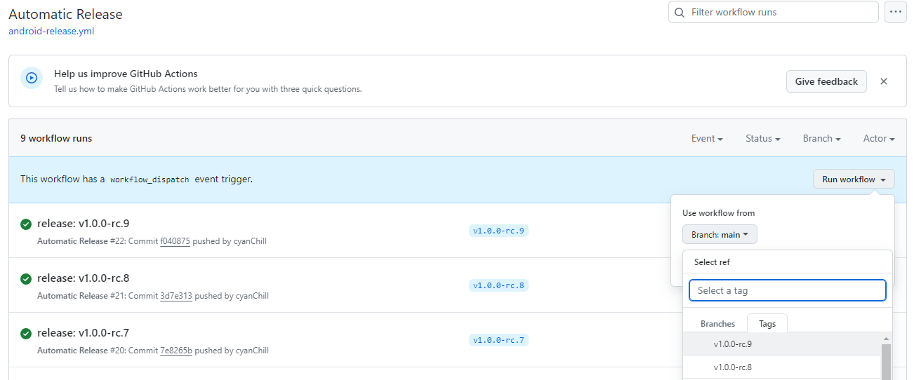

# Building this App

There are 3 ways how you can build this app:

1. Build the unsigned app locally (ideal for personal use).
2. Build the unsigned app via GitHub Actions (ideal for personal use).
   - Refer to the [Personal Privacy Build](./personal-privacy-build.md) documentation on how to do this.
3. Build the app using GitHub Actions (ideal for production).

Except for the "Build the unsigned app via GitHub Actions" option, there are some **prerequisites**:

1. Basic understanding of the command line.
2. Have [git](https://git-scm.com/) installed and some knowledge of basic commands.
3. Have [Node.js](https://nodejs.org/en/download/prebuilt-installer) installed.
4. Have a Java Development Kit (JDK) and Android Studio installed.
   - You can follow [this quick start guide from Expo](https://docs.expo.dev/get-started/set-up-your-environment/?mode=development-build&buildEnv=local) (follow all the instructions until the "Running your app on an Android device" section).
5. A code editor such as VSCode.
6. A USB Debugging enabled device.

## (Unsigned) Local Build

This will build the app directly onto your connected device. In addition, you can find the "release" variants of the unsigned APKs generated in the `android/app/build/outputs/apk/release` directory. There will be [different APK files](https://developer.android.com/ndk/guides/abis.html#sa), for modern Android devices, the `app-arm64-v8a-release.apk` is used.

1. Clone the repository.

   ```sh
   git clone https://github.com/MissingCore/Music.git
   ```

2. Navigate to the project directory.

   ```sh
   cd Music
   ```

3. Install dependencies (we use `pnpm`, but you can use `npm`).

   ```sh
   npm i
   ```

4. Connect your Android device to your computer via a USB cable.

5. Run the following command to build the app locally on your computer via Expo, which will add the app to your phone upon completion.

   ```sh
   npm run android:prod
   ```

> [!NOTE]  
> You may receive a prompt on your device asking: "Allow USB debugging". Click **OK** to allow USB debugging on your PC. If you hit **Cancel**, the build command will fail. To allow USB debugging after canceling, reconnect your device with the USB cable and run the command again.

## (Signed) GitHub Actions Build

> [!IMPORTANT]  
> This section is mainly for documentation purposes and probably shouldn't be used as you cannot upload this app to the Play Console as this app id is already used.

This utilizes a GitHub Actions workflow to build the APKs (that can be published to other stores) along with an `.aab` file ready for the Play Console. Whenever a new tag is created of a certain format, the workflow will automatically run and build the APKs & `.aab` files and upload the `.aab` file to the Play Console if you have that set up.

1. Generate an upload key via `keytool` which comes with your installation of Java (which you should have if you installed Android Studio) by running the [command below (which is referenced from a React Native guide)](https://reactnative.dev/docs/signed-apk-android#generating-an-upload-key). This will generate a `keystore.jks` file in the directory where `keytool` is located.

   ```sh
   sudo keytool -genkey -v -keystore keystore.jks -alias key-alias -keyalg RSA -keysize 2048 -validity 10000
   ```

> [!IMPORTANT]
>
> - **You should change `key-alias` to be something unique if you plan on publishing this app.**
> - **Keep the password you inputted as that'll be important later on.**
>   - Try to limit the use of certain characters (ie: `$`, `` ` ``, `=`) in the password as it breaks the behavior of the GitHub Actions script.
> - You can move `keystore.jks` to a more accessible location (ie: somewhere in the `/Downloads` directory).

2. Open up `Git Bash` when it was installed with `git`. You want to go to the directory where the `keystore.jks` file is by running `cd "<directory>"`. Then run the following command to encode `keystore.jks` into a base64 file.

   ```sh
   openssl base64 < keystore.jks | tr -d '\n' | tee keystore.base64.txt
   ```

   > We want to encode `keystore.jks` in base64 as we want to keep this file secret and prevent exposing it. By encoding it in base64, we can save this as a GitHub Actions secret and use it within the workflow.

3. Clone or fork this repository on GitHub.

4. Now we need to add some secrets. When in the cloned repository, click: `Settings > Secrets and variables > Actions`. Click `New repository secret`. We're going to create the following secrets:

   | Name                               | Secret                                                                                                                                                                                                                                                                                                                                                    |
   | ---------------------------------- | --------------------------------------------------------------------------------------------------------------------------------------------------------------------------------------------------------------------------------------------------------------------------------------------------------------------------------------------------------- |
   | `RELEASE_CRED`                     | _Remember to remove the angle brackets._<br/><pre><code>RELEASE_KEYSTORE_PASSWORD=<UPLOAD_PASSWORD from Step 1>&#13;RELEASE_KEY_ALIAS=<unique key-alias from Step 1>&#13;RELEASE_KEY_PASSWORD=<UPLOAD_PASSWORD from Step 1>&#13;</code></pre>                                                                                                             |
   | `SENTRY_PROPERTIES`                | _Remember to remove the angle brackets._<br/><pre><code>default.project=<Sentry project name\>&#13;default.org=<Sentry organization name with this project\>&#13;auth.token=<Sentry organization auth token (meant for CI)>&#13;</code></pre>                                                                                                         |
   | `KEYSTORE_BASE64`                  | Put the contents of `keystore.base64.txt`.                                                                                                                                                                                                                                                                                                                |
   | `MISSINGCORE_BOT_GITHUB_TOKEN`     | Put a [Fine-Grained Personal Access Token](https://docs.github.com/en/authentication/keeping-your-account-and-data-secure/managing-your-personal-access-tokens#creating-a-fine-grained-personal-access-token). This token should have `Read & Write` permissions for: `Contents`.                                                                         |
   | `GOOGLE_PLAY_SERVICE_ACCOUNT_JSON` | Paste the contents of the service account JSON file created by following the steps on the [r0adkll/upload-google-play GitHub Actions Repository](https://github.com/r0adkll/upload-google-play?tab=readme-ov-file#configure-service-account). You don't need to give the service account permissions (ie: you don't need to give it `owner` permissions). |

> [!NOTE]  
> If you don't want to automatically upload the `.aab` to the Play Console, don't provide a value to the `GOOGLE_PLAY_SERVICE_ACCOUNT_JSON` secret.
>
> - The `.aab` file can be manually downloaded for a limited time (usually up to 90 days) in the "Artifacts" section of the summary of the action.
> - Do note that this will result in the workflow to fail.

### Manually Triggering a Build

You can manually trigger a build on the "Automatic Release" workflow.

1. In the "Actions" tab, click "Automatic Release" on the side bar on the left.

2. You should see in the middle of the screen, "This workflow has a `workflow_dispatch` event trigger.". Click "Run workflow" and change the "Branch: main" to a tag.

   

3. Then click the "Run workflow" in the dropdown. This will build the app for that specific version of the app.
