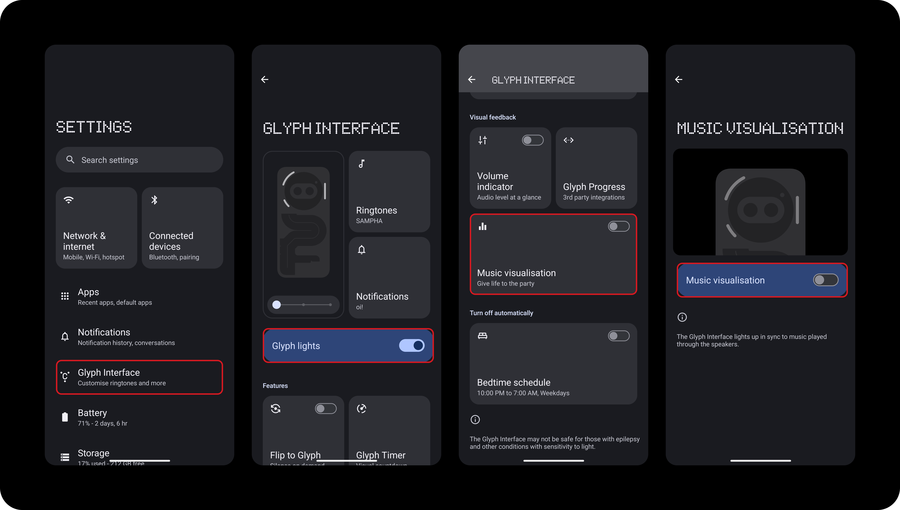

# Nothing Interactions

This document aims to note any features on Nothing devices that this app supports/is compatible with.

## Nothing Media Player Widget

Media played from the app will be detected by the Nothing Media Player Widget. The functions provided by the widget will work as expected (click to play/pause, swipe right for previous song, swipe left for next song). In addition, clicking on the widget while the app is closed will open up the app.

## Nothing Glyph Music Visualization

When `Glyph Lights` and `Music Visualization` are enabled, the glyphs on the back on your Nothing device will act as a rave, syncing with the music played by the app.

