# Personal Privacy Build

This document will go through the steps to build this app for personal privacy. For now, this informs you on how to remove Sentry, the third-party service we use for automatic reporting of any errors encountered.

> [!NOTE]  
> I have built in a feature which notifies users through the Settings page in the app whenever a new version of the app is available (via GitHub Release Notes), which should keep you up-to-date with the latest features.

For simplicity, all of this will be done on GitHub as you don't need to download and set up any unnecessary programs that you may only use once. This means a **GitHub account is required**. You should read [GitHub's Privacy Policy](https://docs.github.com/en/site-policy/privacy-policies/github-general-privacy-statement). In addition, we removed any unnecessary things found in the [`Building this App`](./building-this-app.md) document as technically, you can use this as an alternate way of building the app.

## Step 1: Forking the repository

Go to the [MissingCore/Music](https://github.com/MissingCore/Music) repository and click the `Fork` button.

Then click the `Create fork` button, leaving all fields unchanged.

## Step 2: Create a Personal Access Token

Go to your [GitHub account's setting page](https://github.com/settings/profile) and click `Developer settings`.

Open up the `Personal access token` dropdown menu and click `Tokens (classic)`. Then click the `Generate new token` dropdown and the `Generate new token (classic)` option.

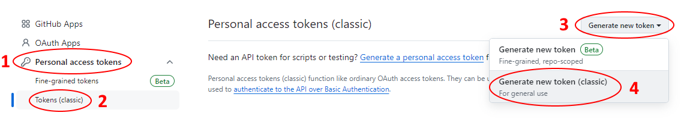

Give a note to this new personal access token (classic) such as "Workflow Token". You then should select an expiration time on the token (for safety reasons and due to infrequent updates, you should set it to `7 days`). Then, select the `workflow` checkbox (the `repo` checkbox will automatically be checked as a result).

> [!IMPORTANT]  
> It's important that you keep the token that's created a secret. If you accidentally leak this token, read [this article from GitHub](https://docs.github.com/en/organizations/managing-programmatic-access-to-your-organization/reviewing-and-revoking-personal-access-tokens-in-your-organization#reviewing-and-revoking--fine-grained-personal-access-tokens) on how you can revoke that token.
>
> In addition, **whenever this token expires, you will have to create a new one again**.

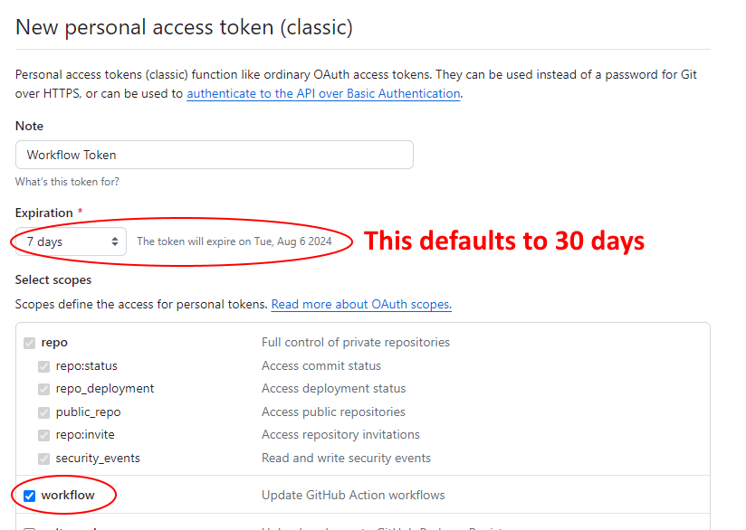

Then click the `Generate token` button after scrolling to the bottom of the screen to create this new token.

Now click the copy button on the token.

Then go back to the forked repository, click the `Settings` tab, open up the `Secrets and variables` dropdown, click `Actions`, then click the `New repository secret` button.

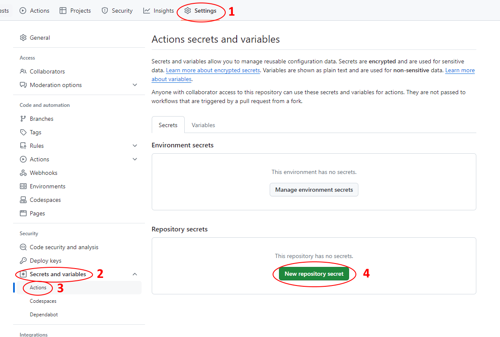

Then, put `WORKFLOW_TOKEN` in the `Name` field and the value of the token we copied in the `Secret` field. Then click `Add secret`.

## Step 3: Enabling GitHub Actions

In the newly created forked repository, click the `Actions` tab and then the `I understand my workflows, go ahead and enable them` button.

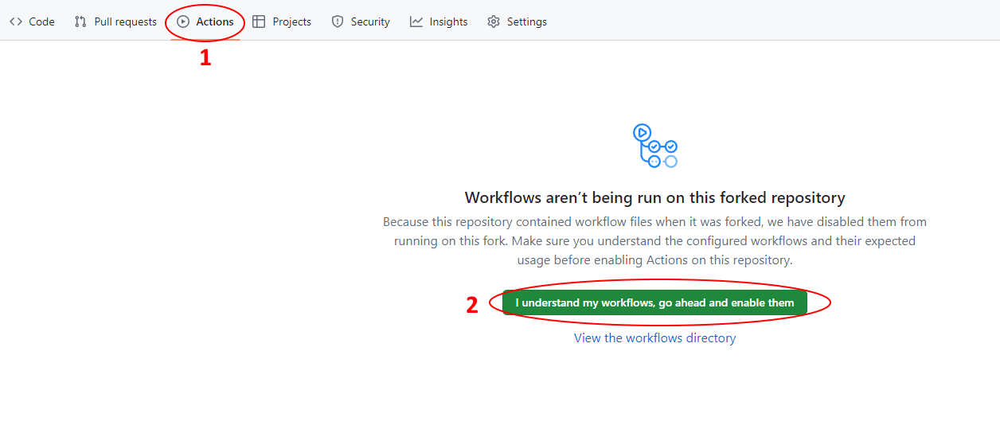

## Step 4: Create branch for latest version of the app (includes pre-release)

> [!IMPORTANT]  
> Depending on the time of writing, the default branch `main` may be replaced with `dev`. In that case, all reference to `main` will be `dev` instead.

Now, click `` Create `latest-stable` Branch `` in the sidebar while in the `Actions` tab. Next click on the `Run workflow` dropdown on the right and click `Run workflow`. Make sure that under `Use workflow from`, `Branch: main` is selected. This will create a new `latest-stable` branch.

> [!IMPORTANT]  
> You should use the `latest-stable` branch instead of the `main` branch as the `main` branch will contain unrelease features that may be unstable or may be structured differently.
>
> In addition, this will also allow you to update the `main` branch of the repository seamlessly for whenever we create a new stable release.

## Step 5: Removing Sentry code

Go back to the `Code` tab and click the dropdown menu which has `main`. From the dropdown, select the `latest-stable` option.

Then click on the `mobile` folder, followed by the `src` folder, followed by the `app` folder, and then `_layout.tsx`. You should see something similar to the following (pay attention to the "breadcrumbs" at the top to make sure you're in the right file):

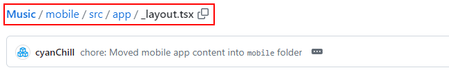

Click the edit button.

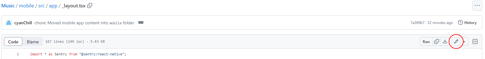

Delete the code highlighted below. This may change throughout versions, but in general, it'll start with `Sentry.init({` and end with `});`.

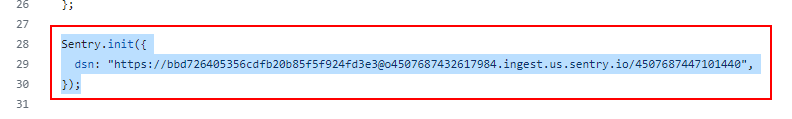

Then click the `Commit changes...` button. You then need to fill out the details to create a new commit and then click the `Commit changes` button to save these changes.

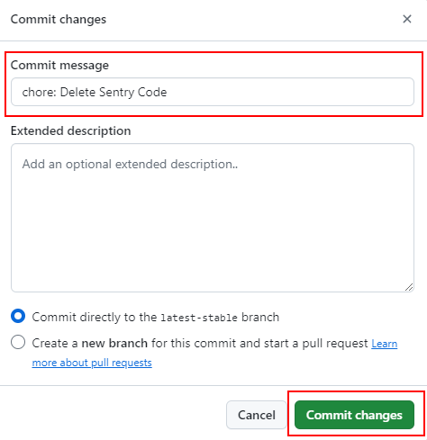

> [!NOTE]  
> We previously required you to modify the `gradle.properties` file to make sure the Sentry code run during build-time doesn't actually run. Now, we updated the workflow to automatically add the `music.CREATE_PRIVACY_BUILD=true` to `gradle.properties`.

### Step 6: Creating APKs without Sentry code

Go back to the `Actions` tab and click `Create Privacy Build APKs` in the sidebar. Next click on the `Run workflow` dropdown on the right and **select `Branch: latest-stable`**. Then click `Run workflow`.

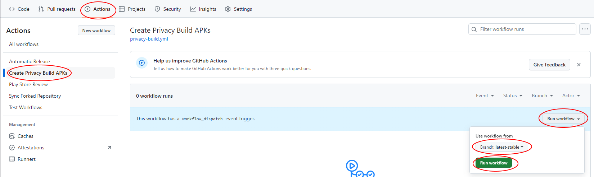

> [!NOTE]  
> This should take around ~15-20 minutes to complete.

In case you see that the workflow throws an error such as: `Gradle build daemon disappeared unexpectedly (it may have been killed or may have crashed)` or `Execution failed for task ':app:collectReleaseDependencies'.`, just re-run the workflow.

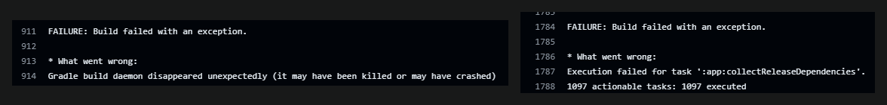

To re-run the workflow, you should see a `Re-run jobs` dropdown. Click the `Re-run failed jobs` option.

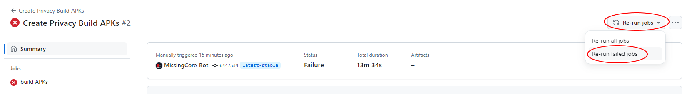

Click the `Re-run jobs` button in the `Re-run failed jobs` pop-up that appears.

### Step 7: Download your APKs

Click the latest successful run of the `Create Privacy Build APKs` workflows. Inside, you should see an `Artifacts` section with an `outputAPKs`. `outputAPKs` is a zip folder containing all the APK types.

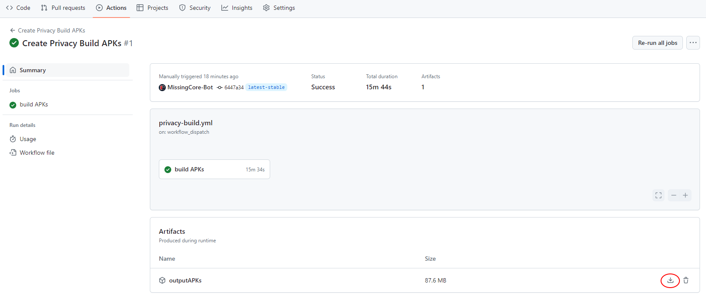

Download `outputAPKs` and unzip it. Then, send the `.apk` file to your device for installation (ie: via a USB cable).
`app-arm64-v8a-release.apk` is the one that should be used with most modern devices (you should look up what APK variant your device supports).
