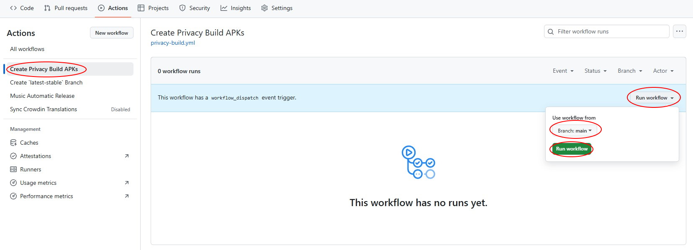

# Personal Privacy Build

This document will go through the steps to build this app for personal privacy, which removes Sentry, the third-party service we use for automatic reporting of any errors encountered.

> [!NOTE]  
> I have built in a feature which notifies users through the Settings page in the app whenever a new version of the app is available (via GitHub Release Notes), which should keep you up-to-date with the latest features.

For simplicity, all of this will be done on GitHub as you don't need to download and set up any unnecessary programs that you may only use once. This means a **GitHub account is required**. You should read [GitHub's Privacy Policy](https://docs.github.com/en/site-policy/privacy-policies/github-general-privacy-statement). In addition, we removed any unnecessary things found in the [`Building this App`](./building-this-app.md) document as technically, you can use this as an alternate way of building the app.

## Step 1: Forking the repository

Go to the [MissingCore/Music](https://github.com/MissingCore/Music) repository and click the `Fork` button.

Then, making sure we **uncheck the "Copy the `dev` branch only" option**, we click the `Create fork` button.

## Step 2: Enabling GitHub Actions

In the newly created forked repository, click the `Actions` tab and then the `I understand my workflows, go ahead and enable them` button.

## Step 3: Creating APKs without Sentry code

Now on the `Actions` tab, click `Create Privacy Build APKs` in the sidebar. Next click on the `Run workflow` dropdown on the right and **select `Branch: main`**. Then click `Run workflow`.

> [!NOTE]  
> The `main` branch contains the code for the current version of the app available on the Google Play Store. This should take around ~15-30 minutes to complete.

### If The Workflow Fails

> [!NOTE]  
> This shouldn't happen anymore, but if it does for whatever reason, here are the steps to re-run the workflow.

In case you see that the workflow throws an error such as: `Gradle build daemon disappeared unexpectedly (it may have been killed or may have crashed)` or `Execution failed for task ':app:collectReleaseDependencies'.`, just re-run the workflow.

To re-run the workflow, you should see a `Re-run jobs` dropdown. Click the `Re-run failed jobs` option.

Click the `Re-run jobs` button in the `Re-run failed jobs` pop-up that appears.

## Step 4: Download your APKs

Click the latest successful run of the `Create Privacy Build APKs` workflows. Inside, you should see an `Artifacts` section with an `outputAPKs`. `outputAPKs` is a zip folder containing all the APK types.

Download `outputAPKs` and unzip it. Then, send the `.apk` file to your device for installation (ie: via a USB cable).
`app-arm64-v8a-release.apk` is the one that should be used with most modern devices (you should look up what APK variant your device supports).
