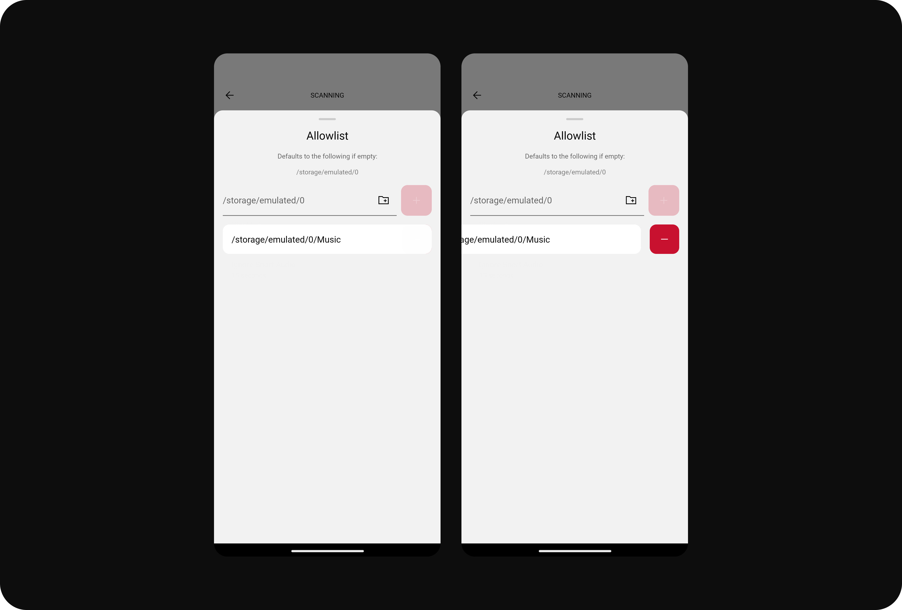

# Supported Gestures

This document aims to document any gesture behavior/interactions that this app includes.

## Swipe for Actions

This involves swiping left on some content to reveal actions related to that content. It's currently present in the following features.

### Filter List Entries

You can swipe left to reveal the delete button on an allowlist or blocklist filter. This makes it harder to accidentally delete a filter (as this would require 2 steps to delete) as we've previously not had a modal to confirm the action.

