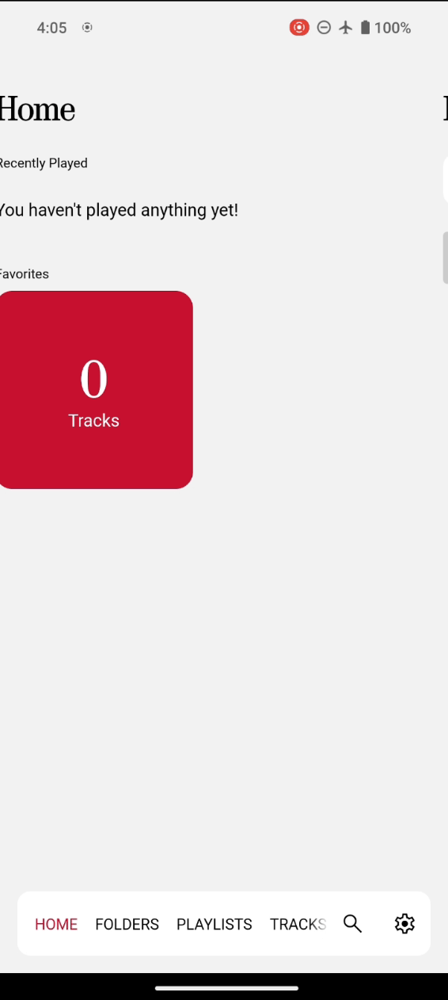
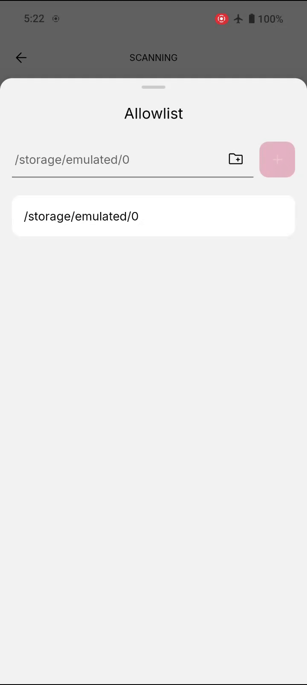
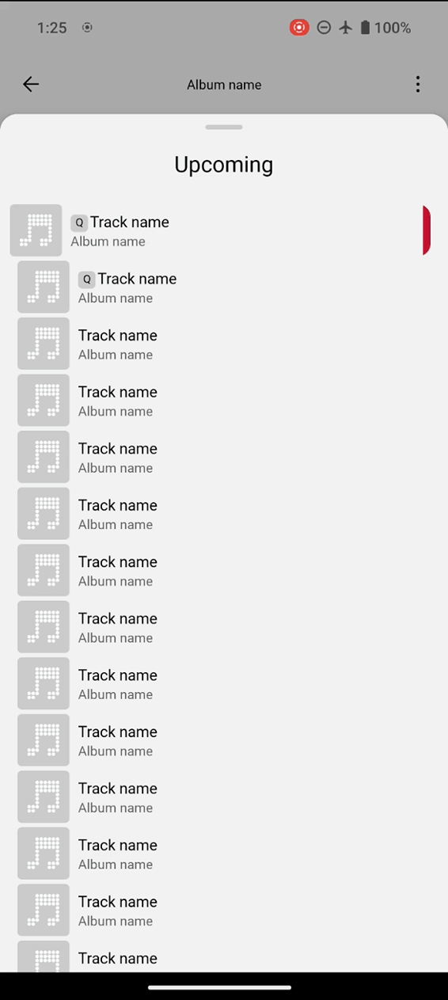

# Supported Gestures

This document aims to document any gesture behavior/interactions that this app includes.

## Swipe for Actions

This involves swiping left on some content to reveal actions related to that content. It's currently present in the following features.

- **`Home Navigation`:** You can swipe on the home screen to navigate through the 6 different screens instead of using the navigation bar.
- **`Filter List Entries`:** You can swipe left to reveal the delete button on an allowlist or blocklist filter. This makes it harder to accidentally delete a filter (as this would require 2 steps to delete) as we've previously not had a modal to confirm the action.
- **`Queue List`:** You can swipe left on tracks that are part of the queue in the "Upcoming" modal (indicated by the `Q`) to reveal the remove button.
- **`Playlist Tracks`:** You can swipe left on tracks in the playlist screen or playlist modification screen (create or edit) to reveal an option to remove the track from that playlist.

<table>
  <thead>
    <tr>
      <th align="center"><code>Home Navigation</code></th>
      <th align="center"><code>Filter List</code></th>
      <th align="center"><code>Queue List</code></th>
    </tr>
  </thead>
  <tbody>
    <tr>
      <td align="center">
        
      </td>
      <td align="center">
        
      </td>
      <td align="center">
        
      </td>
    </tr>
  </tbody>
</table>

## Long-Press for Action

This involves long-pressing an item to reveal some action. It's currently present in the following features.

- **`Artist & Playlist Artwork`:** You can long-press on the artist or playlist artwork on their respective screens to reveal a modal to change or remove the specified artwork.
- **`Playlist Tracks`:** You can long-press on tracks in the playlist screen or playlist modification screen (create or edit) to change its order/position in the playlist.
