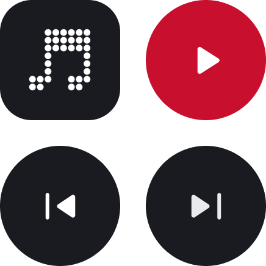
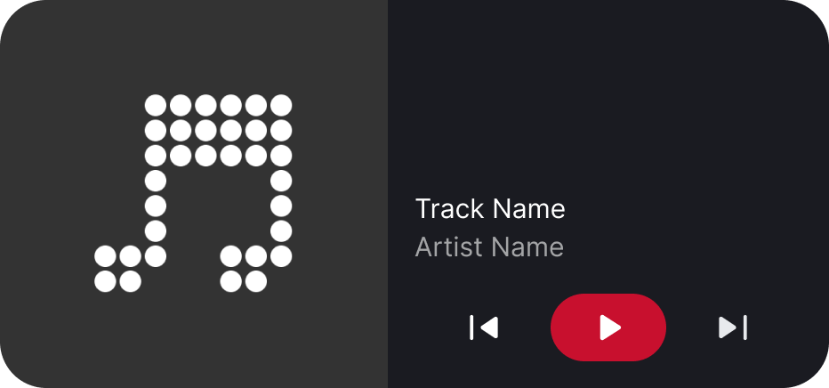

# [🧪 Experimental] Widgets

> [!IMPORTANT]  
> Widgets are an experimental feature and as such, may not get official support or work as expected.

These widgets are made through the awesome [`react-native-android-widget` package by Stefan Aleksovski](https://github.com/sAleksovski/react-native-android-widget).

Widget design is pretty limited as we have to account for the different Android versions and home screen layouts. For example, a `1×1` area on the home screen might not necessarily be a square.

> [!NOTE]  
> For the best experience, it's recommended to enable the `Continue Playback on Dismiss` experimental feature as well. Otherwise, when you dismiss the app, clicking on the widget (should) open the app instead of their expected behavior.

## Current Widgets

What all widgets have in common is that if no track is queued / the app has been dismissed when `Continue Playback on Dismiss` is disabled, clicking on the widget will open the app instead.

There's no indicator for playback progress as I don't want to trigger a widget update every second.

### [2×2] Artwork Player

Displays the current playing track artwork. Clicking on the widget will play/pause the current track.

### [2×2] Now Playing

Offers quick access to media controls (Play/Pause, Prev, Next). Clicking on the artwork will open the app.

### [4×2] Now Playing

Offers quick access to media controls (Play/Pause, Prev, Next). Clicking anywhere but the media controls will open the app.

## Known Issues

- The widget when placed might be initially invisible (launching the app at least once should fix it).
- Dismissing the app (with `Continue Playback on Dismiss` disabled) then immediately clicking the widget may "crash" the app (you get the app launch animation, then it closes).
  - This is probably due to us delaying destroying the foreground service by `1s` to let the widget get updated one final time.
- Widget won't update on screen reorientation ([ref](https://github.com/sAleksovski/react-native-android-widget/issues/96)).
- Some interactions/animation may become slower/laggier when using the "Now Playing" widget (or in general multiple widgets).
  - ie: This can be seen when pressing the play/pause button and see the "pressed" state lasting a bit longer.
  - This is probably due to the JS thread becoming blocked/busy as we're notifying each widget to update.
